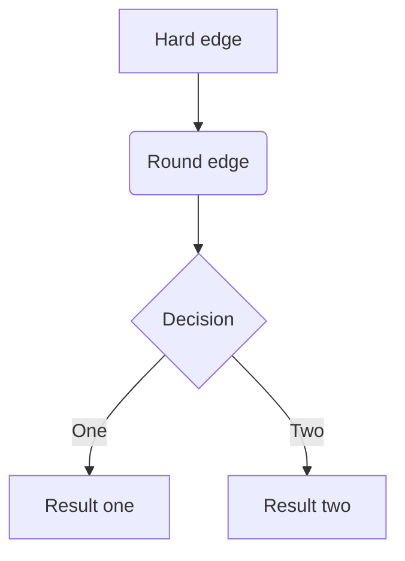

<center><b>DAY 1 study Note</b></center>


[toc]


# _***hello***_

## _hello world_

### hello world

## hello world


开始


在 markdown 源代码中，段落由多个空行分隔。 只需按下 `Return` 即可创建新段落。

按 `Shift` + `Return` 可创建单个换行符。但是，大多数 解析器将忽略单行中断，要使其他 markdown 解析器识别您的换行符，可以在行尾留下两个空格，或者插入 `<br/>`


> 这是一个有两段的块引用。这是第一段。
>
> > 这是第一段。
>
> > 这是第二段。Vestibulum enim wisi, viverra nec, fringilla in, laoreet vitae, risus.  


> 这是另一个只有一个段落的块引用。有三个空行分隔两个块引用。


### 无序列表

* hello
* 菜菜

### 有序列表

1. hello
2. 菜菜


### 任务列表

- [x] 学习1
- [ ] 徐子成

 - [ ] 

 - [x]  

   


### （栅栏式）代码块


```python
a = 1
b = 2
c = a + b
if c < 8:
    print(c)
else:
   print(a, b)
```


### 数学公式块


$$
x2+y2=z2
$$


### 表格


| 名字   | 年龄 | 生日       |
| :------: | :----: | :---------- |
| 徐子成 | 18   | 2004/01/24 |

### 脚注

[^footnote]:徐子成的学习日记
[^111]:day 1
[^]: 

1233555[^1]:1234:

[^1]: 1223335


### 水平线


***

---

+++

---


### 链接

#### 内联和引用

是[百度](www.baidu.com/ "百度web")

[google](www.google.com)是我的请求web

#### 内部链接

**常规括号内的 设置为文档内的某一个标题**，这将创建一个书签，允许您在单击后跳转到该部分。


#### 参考链接

[google][id]是我的请求web

[id]:www.google.com	"023"

参考样式链接使用第二组方括号，在其中放置您选择的标签以标识链接：

```
This is [an example][id] reference-style link.

然后，在文档中的任何位置，您可以单独定义链接标签，如下所示：

[id]: http://example.com/  "Optional Title Here"
```


#### 隐式链接

[QQ][]

[QQ]:www.qq.com

例如，将“Google”一词链接到google.com网站，您只需写下：

```
[Google][]
然后定义链接：

[Google]: http://google.com/
```

在typora中单击链接将其展开以进行编辑，command + 单击将在 Web 浏览器中打开超链接。

### URL网址

<www.baidu.com>

2924846542@qq.com

Typora允许您将 URL 作为链接插入，用 `<`括号括起来`>`。

`<i@typora.io>` 成为 [i@typora.io](mailto:i@typora.io).

- Typora也将自动链接标准URL。例如： www.google.com.

`<qq.com>`

#### 图片

图像与链接类似， 但在链接语法之前需要添加额外的 `!` 字符。 图像语法如下所示：

```


```

您可以使用拖放操作从图像文件或浏览器来插入图像。并通过单击图像修改 markdown 源代码。如果图像在拖放时与当前编辑文档位于同一目录或子目录中，则将使用相对路径。


### 强调（斜体）

`* text *`

*请注意，如果您导出的文档与当前使用的主题不同*

`_ text _`


_则某些美人鱼选项将\*不会应用\*_于导出的HTML / PDF / 图像。

\*例如，如果您当前使用它们 Github，但在导出到 PDF 时，您将主题 YYY 设置为 PDF 导出，并且 YYY.css 定义 ，则不会应用于导出的 PDF.\*

### 粗体

用两个 * 或 _ 包裹的文本将使用HTML `<strong>` 标签包裹

当前使用它们 

**当前使用它们**

__当前使用它们 __


### 代码

要指示代码范围，请使用反引号（`）进行包裹

`print()`

`123456`


### 删除线

通过添加语法来创建删除线文本，标准的Markdown中缺少该文本

`~~text~~` = ~~text~~

`~~错误的文字。~~` 变成 ~~错误的文字。~~

~~`~~错误的文字。~~` 变成 ~~错误的文字。~~


### 下划线

下划线由原始HTML提供支持。

`<u> 下划线 </u>` 变成 <u>下划线</u>

<u>通过添加语法来创建删除线文本，标准的Markdown中缺少该文本</u>


### 表情符号 :smile:

:happy:=`:happy:`


### 内联数学公式

$$
x2+y2=1
$$


`

### 高亮

下划线由原始HTML提供支持


## HTML

您可以使用HTML来设置纯 Markdown 不支持的内容，例如， `<span style="color:red">this text is red</span>` 用于添加红色文本。

 <span style="color:red">this text is red</span>

 <span style="color:yellow">this text is red</span>

 <span style="color:green">this text is red</span>

 

### 嵌入内容

有些网站提供基于iframe的嵌入代码，您也可以将其粘贴到Typora中

```html
<iframe height='265' scrolling='no' title='Fancy Animated SVG Menu' src='http://codepen.io/jeangontijo/embed/OxVywj/?height=265&theme-id=0&default-tab=css,result&embed-version=2' frameborder='no' allowtransparency='true' allowfullscreen='true' style='width: 100%;'></iframe>
```

### 视频

您可以使用 `<video>` HTML标记嵌入视频，例如：

```Markdown
<video src="xxx.mp4" />
```

<video src="www.baidu.com/1.mp3" />


### 其他 HTML 支持

你可以在 [这里](http://support.typora.io/HTML/)找到细节。

1. Here is the *text* of the **footnote**. [↩](https://support.typora.io/zh/Markdown-Reference/#fnref:footnote)

## 绘制图表

### 序列图

```sequence
安德鲁->中国:说你好 注意
中国->安德鲁:你好吗？
安德鲁->>中国:我很好，谢谢！
A-->B:正常行 
B-->C:虚线 
C->>D:打开箭头 
D-->>A:虚线打开箭头
```

### 流程图

```flow
st=>start: Start
op=>operation: Your Operation
cond=>condition: Y or ?
e=>end

st->op->cond
cond(no)->e
cond(yes)->op

```



